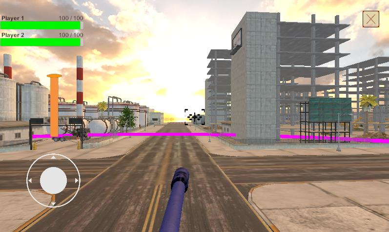
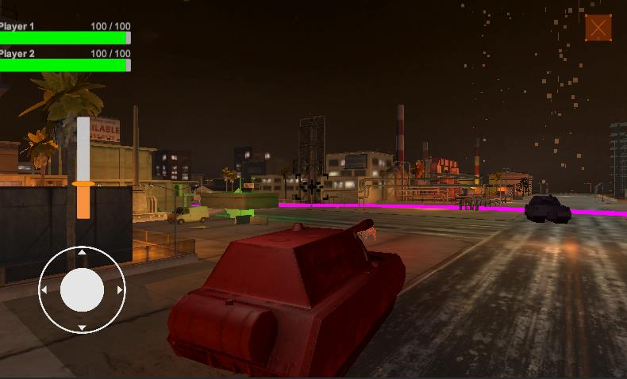
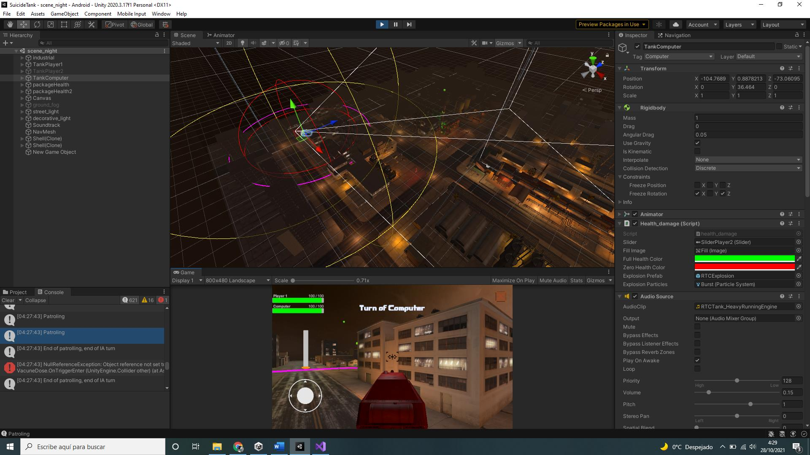
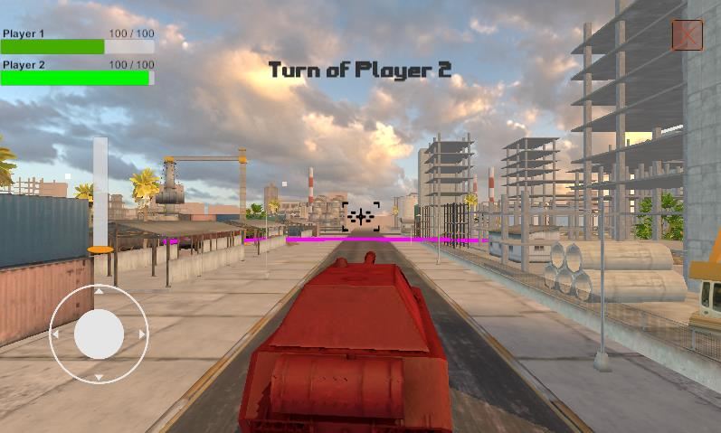
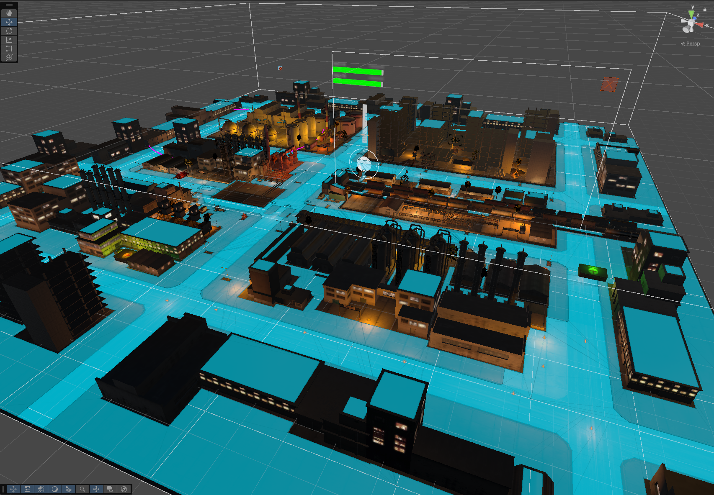
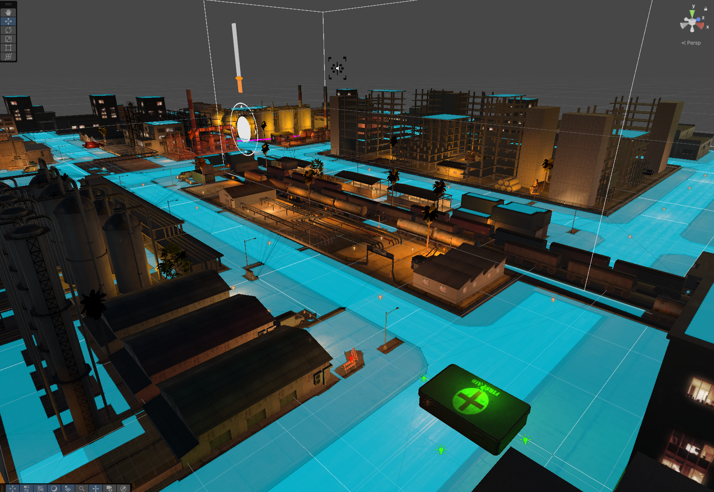

# Suicide Tank: Tactical Turn-Based Tank Shooter

[](https://unity.com/) [](https://opensource.org/licenses/MIT)

**Suicide Tank** is a dynamic turn-based tactical shooter where players command powerful tanks in head-to-head combat. Engage in strategic battles, outmaneuver your opponent, and unleash devastating firepower to achieve victory.

Initially designed with mobile gameplay in mind for **Android**, Suicide Tank is also fully enjoyable on **PC**.

The game supports both player-versus-player and player-versus-AI modes, offering varying levels of challenge.

## Media Showcase

Watch the action unfold! (wait a little for the video to load)

**Trailer:**


**Screenshots:**

| Android Gameplay                                  | Night Mode Battles                               |
| :------------------------------------------------: | :----------------------------------------------: |
|  |          |

| Development Area                                  | PvP Action                                       |
| :-------------------------------------------------: | :----------------------------------------------: |
|  |  |

*(Make sure the images above are in a 'Media' folder in your repository, or update their paths accordingly)*

## Gameplay & Features

*   **Turn-Based Tactical Combat:** Plan your moves انرژیetes and attacks carefully in a turn-based system.
*   **Game Modes:**
    *   **Player vs Player (PvP):** Challenge a friend in local multiplayer.
    *   **Player vs AI (PvComputer):** Test your skills against an AI opponent with multiple difficulty levels.
    *   **Story Mode:** (Details to be expanded based on game content) Embark on a narrative-driven campaign.
    *   **Challenge Mode:** (Details to be expanded based on game content) Tackle specific combat scenarios and objectives.
*   **AI Difficulty:** The AI opponent features adjustable difficulty levels, primarily influencing its attack precision and potentially tactical decision-making, controlled within `EnemyAIComputer.cs`.
*   **Dynamic Environments:** Battle across diverse maps that may require different tactical approaches.



## Technical Overview & Architecture

**Suicide Tank** is developed using the Unity Engine, leveraging C# for scripting. The architecture is component-based, following Unity's design paradigms.

### Core Scripts & Systems:

*   **`TurnPlayer.cs`**:
    *   Manages the overall game flow, determining whose turn it is (Player 1, Player 2, or AI).
    *   Handles the activation/deactivation of control scripts for the current tank.
    *   Initiates turn transitions and UI updates related to turns.

*   **`TankController.cs` (Player Tanks):**
    *   Responsible for player-controlled tank movement (forward, backward, rotation) via keyboard and an on-screen joystick (`Joystick.cs`).
    *   Implements a dynamic "movement limit zone" (a circle with `radiusLimit` centered on the tank's starting position for the turn) to constrain movement and encourage strategic positioning. This zone is visualized using a LineRenderer and reset each turn via `OnEnable()`.

*   **`TankShooting.cs` (Player Tanks):**
    *   Manages the player's weapon system.
    *   Features a charged shot mechanic: launch force increases while the fire button is held, visualized by a UI slider.
    *   Handles projectile instantiation (`m_Shell` prefab) from a designated `m_FireTransform`.
    *   Controls firing audio cues and particle effects.
    *   Signals the end of a player's turn after firing.

*   **`EnemyAIComputer.cs` (AI Tank):**
    *   The brain of the AI opponent, utilizing Unity's `NavMeshAgent` for pathfinding and movement.
    *   Features a state machine to dictate behavior:
        *   **Patrolling:** When the player is out of sight, the AI randomly selects and moves to `walkPoint`s within its `walkPointRange`. A `Physics.Raycast` ensures the chosen point is on valid ground (`whatIsGround`).
        *   **Chasing (`ChasePlayer`):** If the player is within `sightRange` but outside `attackRange`, the AI pursues the player. `SetDestination` is called (conditionally, to avoid excessive recalculation) to update its path towards the player.
        *   **Attacking (`AttackPlayer`):** When `distanceToPlayer` is less than or equal to `attackRange`, the AI stops (or attempts to) and fires its projectile. Attack precision is influenced by the `difficulty` setting.
    *   Like player tanks, the AI operates within a "movement limit zone" defined by `radiusLimit` and a `centerPosition` that is re-evaluated at the start of each of its turns (in `OnEnable()`) to ensure fair play and prevent static camping.
    *   The `alreadyAttacked` flag ensures the AI fires only once per attack decision cycle within its turn.

*   **`health_damage.cs`:**
    *   Attached to all tank entities (players and AI).
    *   Manages `_currentHealth` and `_startingHealth`.
    *   Detects projectile collisions (objects tagged "Bullet") via `OnCollisionEnter`.
    *   Applies damage (`_damage` value) and updates UI health sliders.
    *   Handles tank destruction, triggering explosion particle effects (`explosionParticles`) and notifying the `TurnPlayer` script to determine a winner.
    *   Includes a `TakeHealth()` method for potential health pickups (`VacuneDose.cs`).

*   **`VacuneDose.cs`:**
    *   A simple script for health pickups. Randomly positions itself on the map and, upon collision with a tank, calls `TakeHealth()` on the tank's `health_damage` script.



*   **`CameraFollow.cs`:**
    *   Ensures the main camera smoothly follows the currently active tank, maintaining a consistent offset and orientation. Updates in `LateUpdate()` for optimal camera movement.

*   **`ThirdPersonInput.cs`:**
    *   Primarily handles turret/tower aiming for player tanks using an on-screen `TouchField`.
    *   Rotates the `tower` transform based on touch input, with clamping for the X-axis (pitch).
    *   Resets turret alignment to the tank body's orientation when the touch field is not active.

### AI Navigation & Combat Logic:

*   **NavMesh System:** The AI relies on a pre-baked NavMesh for pathfinding. The `NavMeshAgent` component handles movement along this mesh.
*   **Dynamic Decision Making:** The AI switches between patrolling, chasing, and attacking based on real-time distance calculations to the player and its defined `sightRange` and `attackRange`.
*   **Movement Zone:** Each turn, both player and AI tanks have a movement radius defined by `TankController.cs` and `EnemyAIComputer.cs` respectively. This zone is re-calculated at the start of each entity's turn from their current position, ensuring the tactical landscape can shift.

## Project Structure

The project follows a standard Unity project layout:

```
SuicideTank/
├── Assets/
│   ├── Scripts/      # All C# game scripts
│   ├── Prefabs/      # Game object prefabs (tanks, projectiles, pickups, etc.)
│   ├── Scenes/       # Game scenes (main menu, levels)
│   ├── Materials/    # Materials used for models
│   ├── Models/       # 3D models
│   ├── Sounds/       # Audio clips
│   ├── Animations/   # Animation files & controllers
│   └── ExternalPackages/ # Any third-party assets
├── ProjectSettings/  # Unity project settings
└── ...               # Other Unity-generated files and folders
```

## Getting Started / Setup

1.  Clone the repository: `git clone https://github.com/ivancastroprojects/game-shooter-tanks-turn.git`
2.  Open the project using Unity Hub with Unity Editor version 2022.3.x or later.
3.  Open the main game scene located in `Assets/Scenes/` (e.g., `MainLevel.unity` - *please update with actual scene name*).
4.  Press Play to start the game.

## Future Development Ideas (Optional)

*   Networked multiplayer.
*   More diverse tank types with unique abilities.
*   Advanced AI behaviors and squad tactics.
*   Destructible environment elements.
*   Expanded Story Mode and Challenge scenarios.

---

For an in-depth look at the development process, technical challenges, and design decisions, please refer to the document:  
[Document Challenge Finished.pdf (direct download)](https://github.com/ivancastroprojects/game-shooter-tanks-turn/raw/main/Document%20Challenge%20Finished.pdf)
